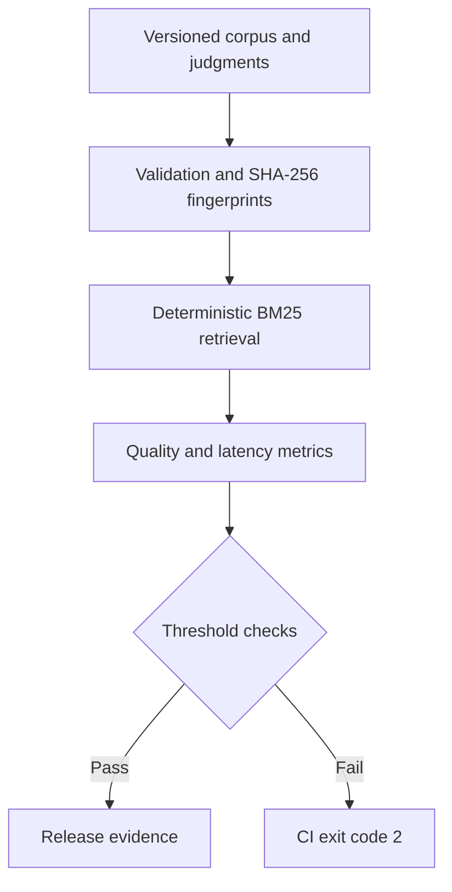

# RAG Evaluation Workbench

A deterministic, local benchmark for answering a practical MLOps question: **did this retrieval change improve the RAG system, or quietly make it worse?**

The workbench builds an auditable BM25 baseline, evaluates versioned relevance judgments, emits a structured experiment artifact, and fails CI when quality or latency crosses a configured threshold. The core uses only the Python standard library and requires no model download, vector database, API key, or paid service.

## What it demonstrates

- Information retrieval: Okapi BM25 with stable ranking and inspectable scores
- ML evaluation: Recall@k, MRR, nDCG@k, per-query evidence, and versioned ground truth
- Responsible AI: citation precision and an explicitly limited lexical groundedness proxy
- MLOps: dataset fingerprints, regression thresholds, artifacts, CI, latency percentiles, and reproducible commands
- Software engineering: typed modules, defensive JSONL validation, atomic output, unit and integration tests, optional API, and a non-root container

## Architecture



The CLI and optional API call the same evaluation core. No LLM is used to judge another LLM, so baseline runs are cheap, offline, and explainable. See [Architecture](docs/ARCHITECTURE.md) for component boundaries and extension points.

## Quick start

Requirements: Python 3.11 or newer.

```bash
git clone <repository-url>
cd rag-eval-workbench
python3 -m venv .venv
source .venv/bin/activate
python -m pip install -e .
```

Run the complete local check:

```bash
make test validate benchmark
```

Or invoke each command directly:

```bash
rag-eval validate \
  --corpus data/v1/corpus.jsonl \
  --queries data/v1/queries.jsonl

rag-eval benchmark \
  --corpus data/v1/corpus.jsonl \
  --queries data/v1/queries.jsonl \
  --thresholds config/regression.json \
  --output artifacts/benchmark.json \
  -k 3

rag-eval search "How should a RAG system handle prompt injection?" \
  --corpus data/v1/corpus.jsonl \
  -k 3
```

The benchmark command exits `0` when every threshold passes, `2` for a measured regression, and `1` for invalid input or an operational error. That contract lets CI distinguish bad experiments from broken runs.

## Reference benchmark

Measured on the included v1 dataset at `k=3`:

| Metric | Result | Configured gate |
|---|---:|---:|
| Recall@3 | 1.000 | ≥ 0.90 |
| MRR@3 | 1.000 | ≥ 0.95 |
| nDCG@3 | 1.000 | ≥ 0.90 |
| Citation precision@3 | 0.433 | ≥ 0.30 |
| Groundedness proxy@3 | 0.871 | ≥ 0.80 |
| Retrieval p95 latency | 0.030 ms | ≤ 100 ms |

Quality results are deterministic for a fixed Python implementation, data, and configuration. Latency depends on hardware and system load; the included 100 ms ceiling is only a smoke-test guard for this tiny corpus. Set a realistic service-level objective on representative infrastructure before production use.

## What the metrics mean

| Metric | Question answered |
|---|---|
| Recall@k | What fraction of the known relevant documents were retrieved? |
| MRR@k | How early did the first relevant document appear? |
| nDCG@k | Were all relevant documents ranked near the top? |
| Citation precision@k | If every returned context were cited, what fraction of citations would be relevant? |
| Groundedness proxy@k | What fraction of unique reference-answer content tokens occur in retrieved contexts? |
| p50 / p95 latency | How fast was median and tail retrieval on this run? |

Citation precision here evaluates retrieved evidence, not a generated citation string. Groundedness is lexical support, not semantic entailment, factuality, safety, or answer correctness. Those distinctions are intentional and recorded in the [Model Card](docs/MODEL_CARD.md).

## Regression gates

Thresholds are ordinary, reviewable JSON:

```json
{
  "minimum": {
    "recall_at_k": 0.90,
    "mrr_at_k": 0.95
  },
  "maximum": {
    "latency_p95_ms": 100.0
  }
}
```

Every run writes the actual value, operator, threshold, and pass/fail decision to `artifacts/benchmark.json`. The artifact also contains the input SHA-256 hashes, retriever parameters, Python version, per-query rankings, scores, metrics, and latency. CI uploads it even when the gate fails, preserving evidence for review.

An abridged reference artifact is available at [`examples/benchmark-summary.example.json`](examples/benchmark-summary.example.json).

## Bring your own evaluation set

Corpus records use one JSON object per line:

```json
{"id":"policy-17","title":"Refund policy","text":"...","metadata":{"team":"support"}}
```

Query judgments use document IDs from that corpus:

```json
{"id":"refund-window","query":"How long can I return an item?","relevant_ids":["policy-17"],"reference_answer":"Items may be returned within the documented window."}
```

Use data you are authorized to process. Do not commit customer text, secrets, regulated data, or production prompts. For breaking judgment changes, create a new folder such as `data/v2/` so historical results remain interpretable.

## Optional local API

Install the API extra and run Uvicorn:

```bash
python -m pip install -e '.[api]'
uvicorn rag_eval_workbench.api:application \
  --factory \
  --host 127.0.0.1 \
  --port 8000
```

Then open `http://127.0.0.1:8000/docs` or run the requests in [`examples/api.http`](examples/api.http). Available endpoints are:

- `GET /health`
- `POST /search`
- `POST /benchmark`

The API is a development adapter without authentication. Keep it on localhost. A production deployment needs identity, authorization, TLS, request limits, tenant isolation, observability, and a reviewed data-retention policy.

## Container

```bash
docker build -t rag-eval-workbench .
docker run --rm -p 8000:8000 rag-eval-workbench
```

The image runs as an unprivileged user and includes only the synthetic sample dataset. Override `RAG_EVAL_CORPUS`, `RAG_EVAL_QUERIES`, or `RAG_EVAL_THRESHOLDS` when mounting another approved dataset.

## Testing and CI

The standard-library test suite covers metric math, stable BM25 ranking, schema and referential-integrity errors, deterministic evaluation, passing gates, and failing CLI exit codes.

```bash
PYTHONPATH=src python -m unittest discover -s tests -v
```

GitHub Actions executes the tests, dataset validation, and regression gate on Python 3.11, 3.12, and 3.13. The benchmark JSON from Python 3.12 is retained as a workflow artifact.

## Security and responsible use

The evaluator assumes corpus and query files are untrusted data. It validates their shape but loads them into memory and does not impose a file-size limit. The development API does not provide authentication. Read the [Threat Model](docs/THREAT_MODEL.md) before connecting private data or exposing a service, and follow [Security Policy](SECURITY.md) for vulnerability reporting.

## Limitations

- The English regex tokenizer has no stemming, lemmatization, phrase model, or multilingual segmentation.
- BM25 cannot reliably recover semantic matches that share no vocabulary.
- Binary relevance judgments cannot express partially useful evidence.
- The bundled dataset is deliberately small and synthetic; it validates engineering behavior, not domain readiness.
- The lexical groundedness proxy can score a contradictory answer highly when words overlap.
- Microbenchmark latency from a tiny in-memory corpus does not predict production vector-search performance.

## Roadmap

- Add pluggable dense and hybrid retrievers behind a common protocol.
- Support graded relevance, query slices, confidence intervals, and paired significance tests.
- Add answer-level evaluation with claim extraction and human-review queues.
- Compare candidate and baseline artifacts with statistically meaningful deltas.
- Export OpenTelemetry spans and ML experiment metadata.
- Add signed dataset manifests and artifact provenance.
- Build a small review UI for failed queries and relevance-label disagreements.

## Repository guide

```text
src/rag_eval_workbench/   dependency-free evaluation core and optional API
data/v1/                  synthetic corpus, judgments, and dataset manifest
config/                   quality and latency regression thresholds
tests/                    standard-library unit and integration tests
docs/                     architecture, threat model, and model card
examples/                 ready-to-run API requests
.github/workflows/        multi-version test and benchmark pipeline
```

Contributions are welcome. Start with [CONTRIBUTING.md](CONTRIBUTING.md), and do not lower a quality threshold without evidence and review.
