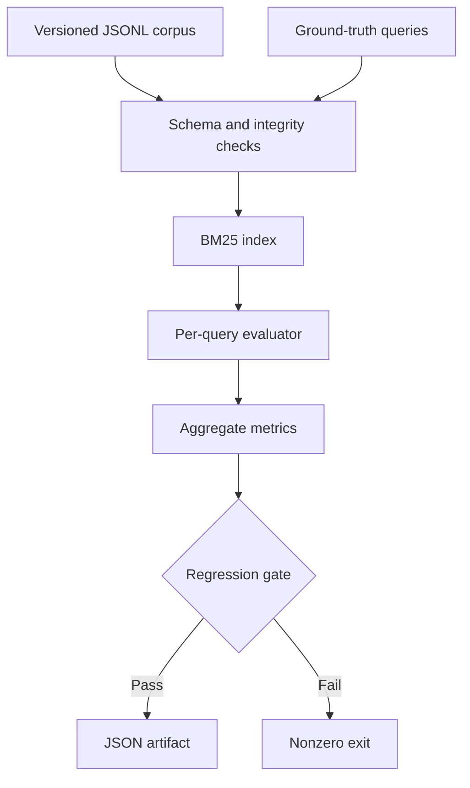

# Architecture

## Goals

The workbench provides a transparent baseline for the question: did a retrieval change make a RAG system measurably worse? The core has no external runtime dependency, performs no network requests, and produces reviewable JSON evidence.

## Components

| Component | Responsibility | Design choice |
|---|---|---|
| `io.py` | Load JSONL, validate identities and references, fingerprint datasets, write artifacts atomically | Fail early on malformed or mismatched evaluation data |
| `retriever.py` | Build and query an in-memory BM25 index | Stable document-ID tie-breaking makes ranking reproducible |
| `metrics.py` | Compute retrieval quality, citation precision, grounding proxy, and percentiles | Small pure functions are easy to audit and unit test |
| `benchmark.py` | Coordinate evaluation, aggregate metrics, evaluate thresholds | JSON schema version and dataset hashes preserve experiment provenance |
| `cli.py` | Provide validate, search, and benchmark commands | Exit code `2` makes a quality regression a CI failure |
| `api.py` | Expose local health, search, and benchmark endpoints | Optional dependency keeps the evaluation core lightweight |

## Data flow and reproducibility

Each benchmark loads the corpus and judgments, validates referential integrity, builds BM25 once, and evaluates every query at the configured `k`. Quality rankings are deterministic. Wall-clock latency is inherently machine-dependent, so the sample latency ceiling is a smoke-test threshold, not a performance service-level objective.

The artifact records:

- schema version and generation time;
- Python and retriever parameters;
- SHA-256 hashes and counts for both input files;
- aggregate and per-query metrics;
- ranked document IDs and scores;
- every threshold comparison and its pass/fail state.

## Extension points

A semantic or hybrid retriever can implement the same `search(query, k)` behavior and reuse the evaluation functions. Graded judgments can extend binary `relevant_ids`; such a change should increment the artifact schema version. Production integrations should emit artifacts to immutable experiment storage rather than committing generated results.
